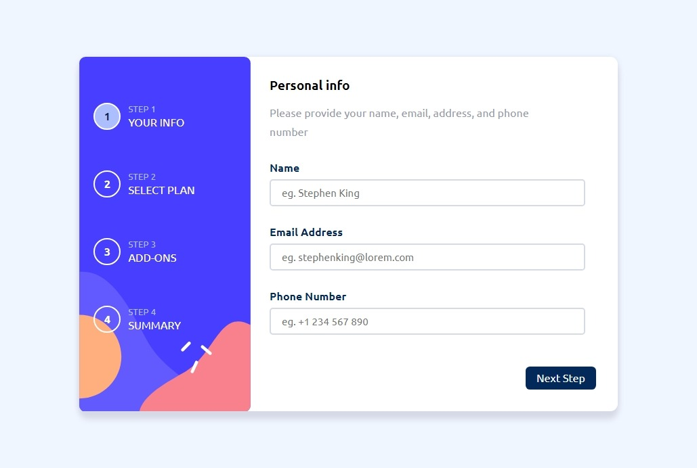
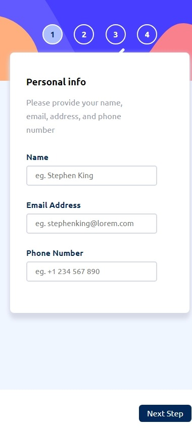
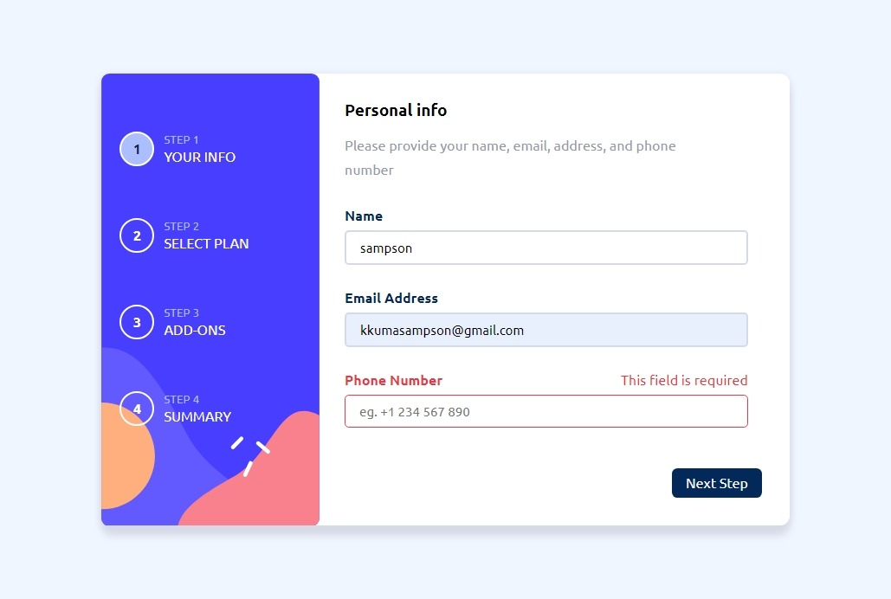

# Frontend Mentor - Multi-step form solution

This is a solution to the [Multi-step form challenge on Frontend Mentor](https://www.frontendmentor.io/challenges/multistep-form-YVAnSdqQBJ). Frontend Mentor challenges help you improve your coding skills by building realistic projects. 

## Table of contents

- [Overview](#overview)
  - [The challenge](#the-challenge)
  - [Screenshot](#screenshot)
  - [Links](#links)
- [My process](#my-process)
  - [Built with](#built-with)
  - [What I learned](#what-i-learned)
  - [Useful resources](#useful-resources)
- [Author](#author)

## Overview

### The challenge

Users are able to:

- Complete each step of the sequence
- Go back to a previous step to update their selections
- See a summary of their selections on the final step and confirm their order
- View the optimal layout for the interface depending on their device's screen size
- See hover and focus states for all interactive elements on the page
- Receive form validation messages if:
  - A field has been missed
  - The email address is not formatted correctly
  - A step is submitted, but no selection has been made

### Screenshot

### Links

- Solution URL: [On github.com](https://github.com/DR-KSP-VIRUS/multi-step-form-app.git)
- Live Site URL: [live site URL here](https://multi-step-form-app-cyan.vercel.app/#/)

## My process

### Built with

- Semantic HTML5 markup
- CSS custom properties
- Flexbox
- CSS Grid
- Mobile-first workflow
- [vue.js](https://vuejs.org/) - Vue framework

### What I learned

As a beginer with [vue.js](https://vuejs.org/) framework, I have learnt more about vueJs component structure, the vue router system and the state management system with pinia.
The state management system is awesome is easy to learn and implement. Also, design navigations with the router is easier as your can add small line of code to get what you want.

### Useful resources

- [Vuejs](https://vuejs.org/) - This helped me for building the components. I really liked this pattern and will use it going forward.
- [vue router](https://router.vuejs.org/) - This is an amazing docs which helped me finally understand navigation system in vue application. I'd recommend it to anyone still learning this concept.
- [Pinia](https://pinia.vuejs.org/) - A state management system with comprehensive docs. easier to learn and implement.

## Author

- Frontend Mentor - [@DR-KSP-VIRUS](https://www.frontendmentor.io/profile/DR-KSP-VIRUS)

